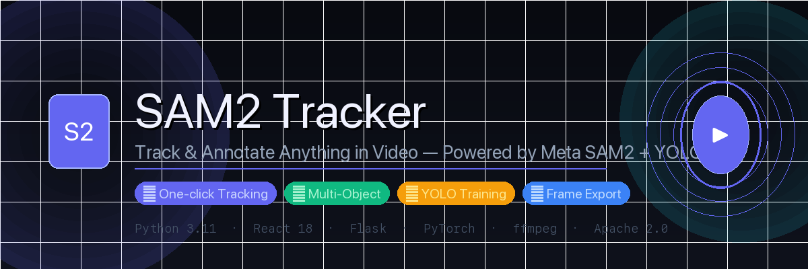
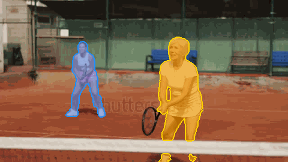

<div align="center">



<br/>

<a href="https://github.com/facebookresearch/sam2">
  
</a>
<a href="https://github.com/ultralytics/ultralytics">
  
</a>
<a href="#">
  
</a>
<a href="#">
  
</a>

<a href="./LICENSE">
  
</a>

</div>

<br/>

> ***QuickLabel*** is a full-stack web application for **interactive video object tracking**, mask annotation, and **YOLO model training** — no code required.
> Upload a video → click any object → tracks across every frame → export annotations → train a custom detector.

***QuickLabel*** is suitable for:
- 🎯 **Surveillance & retail analytics** — track people, vehicles, or products across footage
- 🏷️ **Data annotation** — generate YOLO `.txt` labels automatically from video
- 🤖 **Custom model training** — train a detector directly from the browser with your own data
- 🎬 **Multi-object tracking** — up to 10 objects simultaneously with colored mask overlays

---

## :movie_camera: Demo

<div align="center">



*Two players tracked simultaneously — masks propagated across 72 frames at 10 fps*

</div>

---

## :rocket: Features

| Feature | Description |
|---------|-------------|
| ⚡ One-click tracking | Click any object — segments and tracks instantly |
| 👥 Multi-object | Track up to 10 objects with distinct colored overlays |
| ✂️ Timeline crop | Drag handles to define start/end range |
| 📦 Frame export | Extract frames as `.jpg` + YOLO `.txt` at any FPS |
| 🤖 YOLO training | Merge datasets, configure, and train directly in the browser |
| 💾 Draft saving | Sessions auto-saved — resume incomplete projects anytime |
| 🎛️ Model selection | Switch between 4 model sizes (Tiny → Large) |

---

## :computer: Quick Start — One Command

**Clone once, run anywhere. No branch switching needed.**

```bash
git clone https://github.com/yourname/quicklabel.git
cd quicklabel
```

Then run based on your OS:

### 🍎 macOS / 🐧 Ubuntu

```bash
bash run.sh
```

### 🪟 Windows

```powershell
powershell -ExecutionPolicy Bypass -File scripts/windows.ps1
```

✅ Browser opens automatically → **http://localhost:7262**

> The `run.sh` script **auto-detects your OS** and runs the correct setup — installs all dependencies, creates the Python virtual environment, installs frontend packages, downloads model checkpoints, and starts the app.

---

## :file_folder: Project Structure

```
quicklabel/
├── run.sh                  ← 🚀 Universal launcher (macOS + Linux auto-detect)
├── scripts/
│   ├── mac.sh              ← macOS setup + run
│   ├── ubuntu.sh           ← Ubuntu/Linux setup + run
│   └── windows.ps1         ← Windows setup + run (PowerShell)
├── demo/
│   ├── backend/server/
│   │   ├── app.py          ← Flask API
│   │   └── inference/
│   │       └── predictor.py← AI inference wrapper
│   └── frontend/src/
│       └── routes/
│           ├── ProjectHubPage.tsx   ← home
│           ├── DemoPage.tsx         ← video editor
│           └── TrainPage.tsx        ← YOLO training
├── sam2/                   ← AI model core (Meta)
├── checkpoints/            ← Model weights (auto-downloaded)
├── assets/
│   ├── banner.png
│   └── demo.gif
└── setup.py
```

---

## :world_map: How It Works

### Step 1 — Upload & Track

1. Open **http://localhost:7262**
2. Upload a video (up to 5 min, 250 MB — `.mp4` / `.mov`)
3. Click **"+ Create New Project"**
4. Set crop range using timeline handles *(optional)*
5. Click any object → segments instantly
6. Press **"Track"** → propagates across all frames

### Step 2 — Export Frames

1. Open completed project → **"Extract Frames"**
2. Select FPS (0.5 – 24) → each frame saved as:

```
frame_000001.jpg    ← image
frame_000001.json   ← annotation
frame_000001.txt    ← YOLO format bbox
classes.txt
```

3. Click **"Convert to YOLO"**:

```
YOLODataset/
├── images/train/   images/val/
├── labels/train/   labels/val/
└── dataset.yaml
```

### Step 3 — Train

1. Click **"🎯 Train YOLO Model"** from home
2. Select datasets → **"Merge"** → configure → **"🚀 Start Training"**
3. `best.pt` saved automatically

---

## :brain: Models

| Model | Size | Speed | Accuracy |
|-------|------|-------|----------|
| Tiny  | 38 MB | ⚡⚡⚡ | ★★☆ |
| Small | 46 MB | ⚡⚡  | ★★★ |
| Base+ | 80 MB | ⚡   | ★★★★ |
| Large | 224 MB | 🐢  | ★★★★★ |

Set model size in the script: `MODEL_SIZE=tiny|small|base_plus|large`

---

## :wrench: Requirements

| Tool | macOS | Ubuntu | Windows |
|------|-------|--------|---------|
| Python 3.11 | `brew install python@3.11` | `apt install python3.11` | `winget install Python.Python.3.11` |
| Node.js 18+ | `brew install node` | NodeSource setup | `winget install OpenJS.NodeJS.LTS` |
| ffmpeg | `brew install ffmpeg` | `apt install ffmpeg` | `winget install Gyan.FFmpeg` |
| Yarn | `npm install -g yarn` | `npm install -g yarn` | `npm install -g yarn` |

> All of the above are installed automatically when you run `run.sh` or `scripts/windows.ps1`.

---

## :sos: Troubleshooting

| Problem | Fix |
|---------|-----|
| `python3.11: not found` | macOS: `brew install python@3.11` · Ubuntu: `sudo apt install python3.11` |
| `ffmpeg: not found` | macOS: `brew install ffmpeg` · Ubuntu: `sudo apt install ffmpeg` · Windows: add to PATH |
| `yarn: not found` | `npm install -g yarn` then restart terminal |
| Port 7262/7263 in use | macOS/Ubuntu: `pkill -f "python.*app.py"` · Windows: restart PC |
| Slow tracking | Switch to Tiny model or shorten crop range |
| Session fails to start | Close other apps — 8 GB RAM minimum |
| Windows `activate` fails | Run `Set-ExecutionPolicy RemoteSigned` as Administrator |

---

## :book: Citing QuickLabel

If you use QuickLabel in your research or project, please cite:

```bibtex
@software{quicklabel2024,
  title={QuickLabel: Interactive Video Object Tracking and YOLO Training},
  author={pinklotus.ai},
  year={2024},
  url={https://github.com/yourname/quicklabel}
}
```

---

## :clap: Acknowledgements

- [Segment Anything Model 2](https://github.com/facebookresearch/sam2) — Meta AI Research
- [Ultralytics YOLOv8](https://github.com/ultralytics/ultralytics)

---

## :page_facing_up: License

Apache License 2.0 — see [LICENSE](LICENSE) for details.
